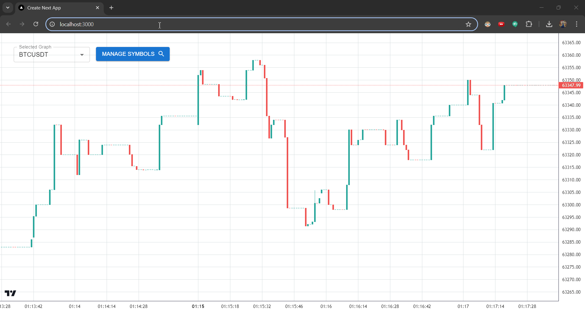

# MarketTracker

MarketTracker is a cutting-edge platform that delivers real-time price data for stocks and cryptocurrencies. With a sleek interface and powerful features, it offers up-to-date market information and stores 1-second interval data in MongoDB for detailed historical tracking.



## Table of Contents

- [Features](#features)
- [Tech Stack](#tech-stack)
- [Setup MongoDB and Redis](#setup-mongodb-and-redis)
- [Setup and Installation](#setup-and-installation)
- [Usage](#usage)
- [Scripts](#scripts)
- [Contributing](#contributing)
- [License](#license)

## Features

- Real-time price updates from Binance
- Historical data fetching (1-second intervals)
- Interactive TradingView chart
- Symbol management with search, pagination, sorting
- WebSocket for live updates
- Efficient Redis caching
- 1-second data storage in MongoDB

## Tech Stack

- **Backend**: Node.js, Express, MongoDB, Redis, BullMQ
- **Frontend**: Next.js, React, Redux, Material-UI, Lightweight-Charts
- **WebSockets**: Binance WebSocket API
- **Logging**: Winston
- **Task Queue**: BullMQ

## Setup MongoDB and Redis

1. **MongoDB**: Follow the [installation guide](https://docs.mongodb.com/manual/installation/) for your OS.
2. **Redis**: Follow the [installation guide](https://redis.io/download) for your OS.

## Setup and Installation

### Prerequisites

- Node.js (>=14.x)
- MongoDB
- Redis
- npm or yarn

### Backend Setup

1. Clone the repository:

   ```bash
   git clone https://github.com/anjalilaishram/MarketTracker.git
   cd MarketTracker/backend
   ```

2. Install dependencies:

   ```bash
   npm install
   ```

3. Create a `.env` file in the `backend` directory:

   ```bash
   BINANCE_API_BASE_URL=https://api.binance.com
   BINANCE_WS_URL=wss://stream.binance.com:9443/ws
   MONGODB_URI=mongodb://localhost:27017/market_tracker
   REDIS_HOST=localhost
   REDIS_PORT=6379
   PORT=5000
   ```

4. Run database migrations:

   ```bash
   npm run migrate
   ```

5. Start the backend server:

   ```bash
   npm run server
   ```

### Frontend Setup

1. Navigate to the `frontend` directory:

   ```bash
   cd ../frontend
   ```

2. Install dependencies:

   ```bash
   npm install
   ```

3. Create a `.env.local` file in the `frontend` directory:

   ```bash
   NEXT_PUBLIC_API_URL=http://localhost:5000/api
   ```

4. Start the frontend development server:

   ```bash
   npm run dev
   ```

## Usage

1. Open your browser and navigate to `http://localhost:3000`.
2. Use the symbol manager to track or untrack symbols.
3. View real-time and historical data on the TradingView chart.

## Scripts

### Backend

- `npm run server`: Start the backend server
- `npm run migrate`: Run database migrations

### Frontend

- `npm run dev`: Start the frontend development server
- `npm run build`: Build the frontend for production
- `npm start`: Start the production server

## Contributing

Contributions are welcome! Please read the [contributing guidelines](CONTRIBUTING.md) for more details.

## License

This project is licensed under the MIT License. See the [LICENSE](LICENSE) file for details.